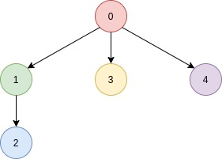
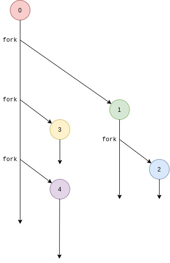
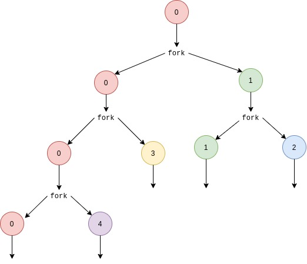
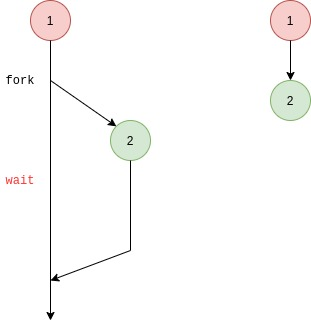

# Miselanea de ejemplos #

## Ejemplos ##

### Llamadas al sistema ### 

Para utilizar los llamados al sistema se puede hacer uso de dos diferentes métodos: la función ```syscall``` o la función de la librería correspondiente.

**Código**: [guia3_ejemplo1.c](guia3_ejemplo1.c)

```C
#include <syscall.h>
#include <unistd.h>
#include <stdio.h>
#include <sys/types.h>

int main(void) {
  long ID1, ID2;
  /*--------------------------------*/
  /* DIRECT SYSTEM CALL             */
  /* SYS_getpid(func no. is 20)     */
  /*--------------------------------*/
  ID1 = syscall(SYS_getpid);
  printf("syscall(SYS_getpid) = %ld\n", ID1);

  /*-----------------------------------*/
  /* "libc" WRAPPED SYSTEM CALL        */
  /* SYS_getpid(func no. is 20)        */
  /*-----------------------------------*/
  ID2 = getpid();
  printf("getpid() = %ld\n", ID2);
  return 0;
}
```

**Preguntas**:
1. ¿Cual es la llamada al sistema que se esta invocando?
2. ¿Cual son los valores de ID1 e ID2?

### Usando fork ### 

En el siguiente ejemplo se usan las llamadas ```getpid``` y ```fork```.

**Código**: [guia3_ejemplo2.c](guia3_ejemplo2.c)

```C
#include <unistd.h>
#include <stdio.h>

int main(int argc, char *argv[]) {
  pid_t valor_retornado;
  printf("Ejemplo de fork. Este proceso va a crear otro proceso\n");
  printf("El PID del programa principal es: %d\n", (int)getpid());
  switch(valor_retornado = fork()) {
    case -1: // Caso de error
       printf("Error al crear el proceso");
       return -1;
    case 0: // Codigo ejecutado por el hijo
       printf("PROCESO HIJO:\n");
       printf("Mi PID es:%d\n", (int)valor_retornado);
       break;
    default: // Codigo ejecutado por el padre
      printf("PROCESO PADRE:\n");
      printf("El PID de mi hijo es:%d\n", (int)valor_retornado);
  }
  // Código ejecutado tanto por el padre como el hijo
  printf("Finalizando el programa...:\n");
  return 0;
}
```
**Preguntas**:
1. ¿Cuál es la salida del programa anterior y por qué?
2. ¿Por cual case se va el hijo y por cual se va el padre y por que?
3. La linea de  código ```printf("Finalizando el programa...:\n");``` ¿Por que es ejecutada tanto por el padre como por el hijo?

### Creando multiples hilos ### 

Un proceso puede crear o tener múltiples hijos llamando repetidamente la función ```fork```. Ademas, estos hijos pueden tener o crear otros procesos (nietos), y asi reiteraticamente permitiendo la formación de una **familia de procesos**. 

En el siguiente ejemplo se muestra como crear varios procesos haciendo uso de estructuras if anidadas para el caso.

**Código**: [guia3_ejemplo3.c](guia3_ejemplo3.c)

```C
#include <stdio.h>
#include <stdlib.h>
#include <unistd.h>
int main () {
    pid_t pid_hijo1;
    pid_t pid_hijo2;
    pid_t pid_hijo3;
    pid_hijo1 = fork(); // Creo el primer hijo
    if (pid_hijo1 == 0) { // Hijo 1
      printf("Soy el hijo 1\n");
      sleep (5);
    } else {  // Padre
        pid_hijo2 = fork(); // Creo al segundo hijo
        if (pid_hijo2 == 0) { // Hijo 2
          printf("Soy el hijo 2\n");
          sleep (5);
        } else {  // Padre
            pid_hijo3 = fork();  // Creo al tercer hijo
            if (pid_hijo3 == 0) { // Hijo 3
              printf("Soy el hijo 3\n");
              sleep (5);
            } else {  // Padre
              printf("Soy el padre\n");
              sleep (5);
            }
        }
    }
    return 0;
}
```

Otra forma es mediante el uso de ciclos tal y como se muestra en el siguiente ejemplo. (**Pilas**: Notese como se hizo el llamado y como dentro del codigo del hijo se hizo un exit para evitar que este retornara al for, esto es algo de cuidado que a muchos nos enreda): 

**Código**: [guia3_ejemplo4.c](guia3_ejemplo4.c)

```C
#include <stdio.h>
#include <stdlib.h>
#include <unistd.h>

int main () {
    int i;
    int numHijos = 3;
    pid_t pid;
    for (i = 0; i < numHijos; i++) {
        pid = fork();
        if (pid == -1) {
            /* Error */
            printf("No fue posible crear un hijo\n");
            return -1;
        }
        if (pid == 0) {
            printf("Soy el hijo #%d con PID: %d\n",i+1, getpid());
            exit(0);
        }
    }
    return 0;
}
```

En la siguiente forma, se puede evitar el problema al que nos ateniamos anteriormente, observe el siguiente código.

**Código**: [guia3_ejemplo5.c](guia3_ejemplo5.c)

```C
#include <stdio.h>
#include <stdlib.h>
#include <unistd.h>


int main () {
  int pid;
  int numHijos = 5;
  int numProceso;
  for(numProceso = 0; numProceso < numHijos; numProceso++) {
      pid = fork();
      if (pid == -1) {
          // Imprimir algún mensaje de error
      } else if(pid == 0) {
          break;
      }
  }
  if (pid == 0) {
      // Lógica del hijo
      printf("Soy el hijo #%d\n", numProceso);
  }
  else {
      printf("Soy un padre perezoso\n");
  }
}
```

**Preguntas**:
1. Analice y entienda las salidas de los 3 códigos anteriormente mostrados.

### Jerarquia de procesos ### 


En el siguiente ejemplo se crea la siguiente jerarquía de procesos mostrada en la siguiente figura:



Para el caso, cada uno de los procesos hijos debe aumentar el valor de una variable e imprimir ese valor en pantalla. 

**Código**: [guia3_ejemplo6.c](guia3_ejemplo6.c)

```C
#include <unistd.h>
#include <stdio.h>

int main(int argc, char *argv[]) {
  pid_t pid_h1, pid_h2, pid_h3;
  pid_t pid_n;
  int i = 0;
  pid_h1 = fork();
  if(pid_h1 == 0) {
    i++;
    pid_n = fork();
    if(pid_n==0) {
      i++;
      printf("NIETO: i = %d\n",i);
    }else {
      printf("HIJO 1: i = %d\n",i);
    }
  }else {
    pid_h2 = fork();
    if(pid_h2 == 0) {
      i++;
      printf("HIJO 2: i = %d\n",i);
    }else {
      pid_h3 = fork();
      if(pid_h3 == 0) {
         i++;
         printf("HIJO 3: i = %d\n",i);
      }else {
         printf("PAPA: i = %d\n",i);
      }
    }
  }
  return 0;
}
```

En los siguientes dos diagramas se hace una representación en como fueron llamadas las funciones fork para generar la jerarguia:

**Diagrama 1**



**Diagrama 2**



**Preguntas**:
1. Analice y entienda la salida del código anterior. ¿El resultado mostrado es coherente con lo visto en teoría?

### Terminación de procesos con exit ###

A continuación se muestra el uso de ```exit``` para terminar un código: 

**Código**: [guia3_ejemplo7.c](guia3_ejemplo7.c)

```C
#include <unistd.h>
#include <stdio.h>
#include <stdlib.h>

int main(int argc, char *argv[]) {
  pid_t pid_hijo;
  printf("El pid del programa principal es: %d\n",(int)getpid());

  switch(pid_hijo=fork()) {

    case -1: /* Código ejecutado en caso de error*/
      printf("Error al crear el proceso");
      return -1;
    case 0: /* Código ejecutado por el hijo */
      printf("Hijo: Valor de retorno fork: %d\n",(int)pid_hijo);
      printf("Hijo: Mi PID: %d\n",(int)getpid());
      printf("Hijo: PID del padre: %d\n",(int)getppid());
      exit(0);
    printf("Esta instrucción nunca se ejecutara en el proceso hijo\n");
      break;
    default: /* Código ejecutado por el padre */
      printf("Padre: PID del proceso hijo: %d\n",(int)pid_hijo);
      printf("Padre: Mi PID: %d\n",(int)getpid());
      printf("Padre: PID de mi padre: %d\n",(int)getppid());
  }
  return 0;
}
```

### Esperando por la terminacion de los hijos con wait ###


**Código**: [guia3_ejemplo8.c](guia3_ejemplo8.c)

```C
#include <unistd.h>
#include <stdio.h>
#include <stdlib.h>
#include <sys/types.h>
#include <sys/wait.h>

int main(int argc, char *argv[]) {
    pid_t pid_hijo;
    int estado;
    printf("El pid del programa principal es: %d\n",(int)getpid());
    switch(pid_hijo=fork()) {
        case -1: /* Codigo ejecutado en caso de error*/
            printf("Error al crear el proceso");
            return -1;
        case 0: /* Codigo ejecutado por el hijo */
            printf("Hijo: PID del proceso %d\n",(int)pid_hijo);
            printf("Hijo: Mi PID %d\n",(int)getpid());
            printf("Hijo: PID del padre %d\n",(int)getppid());
            exit(0);
            printf("Esto nunca se ejecutará en el proceso hijo\n");
            break;
        default: /* Código ejecutado por el padre */
           wait(&estado);
           printf("Padre: el proceso hijo %d finalizó con el estado %d \n",(int)pid_hijo, estado);
           printf("Padre: Mi PID %d\n",(int)getpid());
           printf("Padre: PID de mi padre %d\n",(int)getppid());
    }
    return 0;
}
```

A continuación se muestran los diagramas resaltando los llamados a ```fork``` y ```wait```. Tambien se muestra el diagrama de jerarquia para el caso:



El siguiente código muestra cuando un padre espera que sus hijos culminen. Observe las reitereadas llamadas a ```wait```, una por cada hijo:


**Código**: [guia3_ejemplo9.c](guia3_ejemplo9.c)

```C
#include <unistd.h>
#include <stdio.h>
#include <stdlib.h>
#include <sys/types.h>
#include <wait.h>

int main(int argc, char *argv[]) {
  pid_t pid_h1, pid_h2, pid_h3;
  int status_h1, status_h2, status_h3;
  pid_t pid_n;
  int status_n;
  int i = 0;
  pid_h1 = fork();
  if(pid_h1 == 0) {
    i++;
    pid_n = fork();
    if( pid_n == 0 ) {
      i++;
      printf("NIETO: i = %d\n",i);
    }
    else {
      wait(&status_n); // Papa (hijo 1) esperando hijo (nieto)
      i++;
      printf("HIJO 1: finalizo nieto %u con estado %d\n", pid_n, status_n );
      printf("HIJO 1: i = %d\n",i);
    }
  }
  else {
    pid_h2 = fork();
    if(pid_h2 == 0) {
      i++;
      printf("HIJO 2: i = %d\n",i);
    }
    else {
      pid_h3 = fork();
      if(pid_h3 == 0) {
         i++;
         printf("HIJO 3: i = %d\n",i);
      }
      else {
         // El papa decidió esperar todos los hijos al final
         wait(&status_h1); // Papa esperando un hijo
     printf("PAPA: ha finalizado un hijo con estado %d\n", status_h1);
         wait(&status_h2); // Papa esperando otro hijo
    printf("PAPA: ha finalizado otro hijo con estado %d\n", status_h2);
         wait(&status_h3); // Papa esperando el ultimo hijo
     printf("PAPA: ha finalizado el ultimo hijo con estado %d\n", status_h3);
         i++;
         printf("PAPA: i = %d\n",i);
      }
    }
  }

  return 0;
}
```

### Terminación de procesos con kill ###

**Código**: [guia3_ejemplo10.c](guia3_ejemplo10.c)

```C
#include <unistd.h>
#include <stdio.h>
#include <stdlib.h>
#include <sys/types.h>
#include <signal.h>

int main(int argc, char *argv[]) {
  printf("ID del proceso: %d\n", (int)getpid());
  printf("ID del padre de este proceso: %d\n", (int)getppid());
  for(;;) {
      pause();
  }
  return 0;
}
```

Para este caso, compile el código anterior:

```
gcc -Wall guia3_ejemplo10.c -o guia3_ejemplo10.out
```

Luego ejecutelo en background (para que la consola no se bloquee) observando el PID del proceso:

```
./guia3_ejemplo10.out &
```

Luego ejecute en consola el comando ```ps``` para ver los procesos hijos de la terminal actual. Notará que aparece la PID del proceso anteriormente creado:

```
ps
```

Y finalmente killee el proceso mediante el comando ```kill``` pasando el PID leido (PID_PROCESO):

```
kill -KILL PID_LEIDO
```

En el caso anterior, se vio el uso de ```kill``` como comando, ahora veamos cómo es su empleo como función lo cual es mostrado en el siguiente codigo fuente:


**Código**: [guia3_ejemplo11.c](guia3_ejemplo11.c)

```C
#include <unistd.h>
#include <stdio.h>
#include <stdlib.h>
#include <signal.h>
#include <sys/types.h>

int main(int argc, char *argv[]) {
  pid_t my_pid;
  my_pid = getpid();
  printf("Mi ID del proceso es: %d \n",(int)my_pid);
  printf("El ID del padre del proceso es: %d \n",(int)getppid());
  printf("Hola mundo. \n");
  printf("Hola mundo. \n");
  printf("Hola mundo. \n");
  printf("Hola mundo. \n");
  printf("Hasta la vista baby. \n");
  kill(my_pid,9);//Forma alternativa:kill(pid_hijo,SIGKILL);
  printf("Hasta la vista baby. \n");
  printf("Hasta la vista baby. \n");
  printf("Hasta la vista baby. \n");
  return 0;
}
```

###  Ejecución de nuevos programas mediante la familia de funciones exec ### 

La siguiente tabla muestra a modo de recorderis las diferentes funciones de la familia ```exec```:

|Funcion|Sintaxis|
|:------|:-------|
|**```execl```**|```int execl(const char *path, const char *arg,...);```|
|**```exelp```**|```int execlp(const char *path, const char *arg,...);```|
|**```execle```**|```int execle(const char *path, const char *arg,...,char *const envp[]);```|
|**```execv```**|```int execv(const char *path, char *const argv[]);```|
|**```execvp```**|```int execvp(const char *file, char *const argv[]);```|

A continuación se muestra un código ejemplo y se pide que responda unas preguntas:

**Código**: [guia3_ejemplo13.c](guia3_ejemplo13.c)

```C
#include <unistd.h>
#include <stdio.h>

int main(int argc, char *argv[]) {
	printf("Ejecutable: \n");
	char *args[] = {"/bin/ls", "-l", ".", NULL};
	printf("Forma 1: \n");
	execl("/bin/ls", "/bin/ls", "-l", ".", NULL);
            printf("Forma 2: \n");
	execv("/bin/ls", args);
            printf("Forma 3: \n");
	execvp("/bin/ls", args);
	return 0;
}
```

**Preguntas**:
1. ¿Qué hace el programa anterior?
2. ¿Qué tiene de raro la salida?

A continuación se muestra el uso del **fork y exec** de manera combinada lo cual permite que desde un programa padre se puedan correr otros programas hijos con imagenes diferentes sin que se pierda la imagen del padre original; cosa que sucede cuando se llama solamente cualquier función ```exec``` sin haber hecho previamente la copia del padre con un ```fork```.

El siguiente fragmento muestra el esqueleto de este uso combinado de la pareja ```fork``` - ```exec```:

```C
// ...
if (fork == 0) {
    // Este es el hijo
    execvp(path, args); // Llamado a exec para ejecutar subprograma
}
else
{
    // Este es el padre
    // Llamado a wait para esperar a que el hijo termine
    // (opcional: depende de la situación)
    wait(&status); 
}
```

A continuación se muestra un programa en el cual hay 3 procesos (el padre y los dos hijos creados) los cuales hacen lo siguiente:
* **Proceso padre**: Imprime la frase "Hasta la vista baby" y espera hasta que los procesos hijos culminan.
* **Proceso hijo 1**: Invoca el comando ```ls```
* **Proceso hijo 2**: Invoca el comando ```date```

**Código**: [guia3_ejemplo14.c](guia3_ejemplo14.c)

```C
#include <unistd.h>
#include <stdio.h>
#include <stdlib.h>
#include <sys/types.h>
#include <wait.h>


int main(int argc, char *argv[]) {
  pid_t pid_h1, pid_h2;
  int status;
  pid_h1 = fork();
  if(pid_h1 == 0) {
    // Proceso hijo el cual ejecuta el comando ls
    execl("/bin/ls","/bin/ls","/",NULL);
  }
  else {
    pid_h2 = fork();
    if(pid_h2 == 0) {
      // Proceso hijo que ejecuta el comando date
      execl("/bin/date","/bin/date",NULL);
    }
    else {
      // Proceso padre
      wait(&status); // wait para esperar un proceso
      wait(&status); // wait para esperar el otro proceso
      printf("Hasta la vista baby\n");
    }
  }
  return 0;
}
```

Cabe decir que no solo es posible invocar comandos ya (cuyos ejecutables ya se encuentran existentes). También se pueden invocar ejecutables hechos por nosotros. Por ejemplo, supóngase que usted compilo un programa el cual imprimía la frase hola mundo. Inicialmente usted compila y enlaza el programa asignandole un nombre al ejecutable resultante, ```myExe.out``` por ejemplo. Asumiendo que el ejecutable se encuentra en el mismo directorio de trabajo donde se encuentra el codigo del otro ejecutable que hace el llamado ```exec``` para que este programa sea lanzado, las lineas de codigo de dicho programa serian de la siguiente manera.

```C
// ...
if (fork == 0) {
    // Este es el hijo
    execl("./myExe.out", "./myExe.out", NULL); // Ejecutar subprograma
}
else
{
    // Este es el padre
    // Llamado a wait para esperar a que el hijo termine
    // (opcional: depende de la situacion)
    wait(&status); 
}
...
```